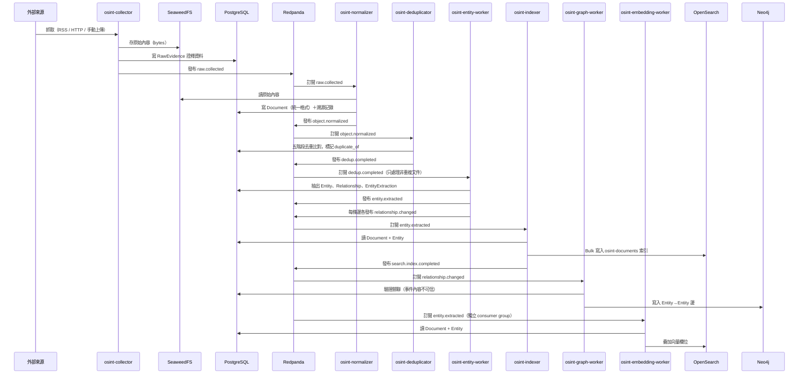
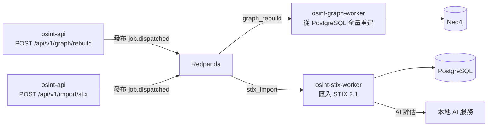

# 資料流

這一頁說明一筆資料從收集到可搜尋、上圖的完整路徑，以及各服務之間怎麼透過事件主題通訊。

---

## 主要流程：從原始資料到可搜尋的情報



---

## 背景任務流程

除了事件驅動的主流程，有些工作透過 Job 系統派發：



Job 狀態機：

```
queued → running → completed
           │
           ├→ failed → retrying → running
           └→ cancelled
```

Job 的執行狀態可透過 `GET /api/v1/jobs/{id}` 查詢。失敗的 Job 可用 `POST /api/v1/jobs/{id}/retry` 重試。

---

## 事件主題清單

Redpanda 上共有 29 個主題（topic）。以下按功能分類，並標明目前有無生產者與消費者。

### 收集階段（V0.1）

| 主題 | 生產者 | 消費者 |
|---|---|---|
| `raw.collected` | osint-collector | osint-normalizer |
| `raw.failed` | osint-collector | — |
| `object.normalized` | osint-normalizer | osint-deduplicator |
| `object.created` | — | — |
| `object.updated` | — | — |
| `dedup.completed` | osint-deduplicator | osint-entity-worker |
| `entity.extracted` | osint-entity-worker | osint-indexer、osint-embedding-worker |
| `search.index.requested` | — | — |
| `search.index.completed` | osint-indexer | — |
| `job.dispatched` | osint-api（`JobService::dispatch`） | osint-graph-worker（`graph_rebuild`）、osint-stix-worker（`stix_import`/`stix_export`） |

### 情報分析階段（V0.2）

| 主題 | 生產者 | 消費者 |
|---|---|---|
| `entity.resolution.requested` | — | — |
| `entity.resolution.completed` | — | — |
| `entity.merged` | — | — |
| `relationship.changed` | osint-entity-worker、merge/undo 操作 | osint-graph-worker |
| `graph.sync.requested` | — | — |
| `graph.sync.completed` | — | — |
| `embedding.requested` | — | — |
| `embedding.completed` | — | — |
| `timeline.updated` | — | — |

!!! note "embedding-worker 不用 embedding.* 主題"
    `osint-embedding-worker` 直接訂閱 `entity.extracted`（獨立 consumer group），
    不透過 `embedding.requested`。`embedding.requested`／`embedding.completed` 主題名稱
    已定義但目前沒有生產者與消費者。

### 發現引擎階段（V0.3）

| 主題 | 生產者 | 消費者 |
|---|---|---|
| `seed.created` | — | — |
| `seed.updated` | — | — |
| `discovery.requested` | — | — |
| `discovery.completed` | — | — |
| `candidate.created` | — | — |
| `candidate.approved` | — | — |
| `candidate.rejected` | — | — |
| `ai.requested` | — | — |
| `ai.completed` | — | — |
| `ai.failed` | — | — |

!!! note "V0.3 主題目前只有定義"
    V0.3 的 10 個主題目前沒有生產者與消費者。Discovery Worker 目前是透過 API 直接呼叫，
    不透過事件觸發。

---

## 事件格式

每則事件都包在統一的 envelope 裡：

```json
{
  "id": "<uuid-v7>",
  "event_type": "entity.extracted",
  "schema_version": "1",
  "source_service": "osint-entity-worker",
  "timestamp": "2026-09-30T12:00:00Z",
  "correlation_id": "<uuid 或 null>",
  "payload": {}
}
```

---

## 冪等性：重跑不會產生重複資料

系統設計讓每個步驟重跑都是安全的：

**Entity 與 Relationship 使用 UUID v5（確定性 ID）。** Entity 的 ID 由 `(entity_type, normalized_name)` 推導，Relationship 的 ID 由 `(source_id, relationship_type, target_id)` 推導。同樣的輸入永遠產生同樣的 ID，插入時 `ON CONFLICT DO NOTHING`，重跑不會產生重複列。

**搜尋索引用 Document ID 當 `_id`。** OpenSearch 的 `_id` 就是 `Document.id`，重送事件是覆寫而不是新增。

**osint-graph-worker 在成功或優雅跳過後才提交 offset。** 失敗不提交，下次重跑同一則事件。

---

## 投影可重建

搜尋索引、關聯圖、向量投影都可以從 PostgreSQL 完整重建，不需要重新收集原始資料：

```bash
make rebuild-index          # 從 PostgreSQL 補齊搜尋投影
make rebuild-index-drop     # 先刪索引再從零重建（mapping 有破壞性變更時）
```

圖資料庫重建透過 API 觸發：

```bash
curl -X POST "$API/graph/rebuild" -H "Authorization: Bearer $TOKEN"
```

重建時 Job 狀態可在 `GET /api/v1/jobs/{id}` 查詢。
