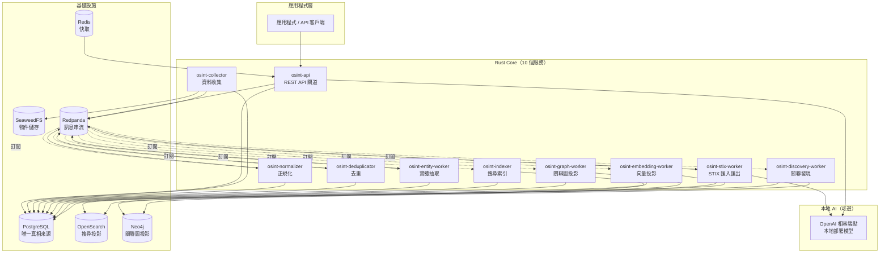

# 系統架構

這一頁描述 OSINT Intelligence Core 的元件組成：10 個 Rust 服務、6 個基礎設施，以及可選的本地 AI 服務。

---

## 整體架構



---

## 服務職責

### osint-api

**對外的唯一入口。** 提供 REST API，負責認證（JWT）、授權（RBAC）、稽核記錄。
所有應用程式讀寫資料都透過這個服務，不直接連資料庫。

- 讀寫：PostgreSQL（主資料庫）、Redis（快取與 session）
- 發布：`job.dispatched`
- 轉發 AI 請求至本地 AI 服務（`POST /entities/{id}/resolve` 的同步路徑）

### osint-collector

**主動去外部來源抓資料。** 支援 RSS/Atom、靜態網頁、REST API 等收集方式。
SSRF 防護預設拒絕私網位址，放行需要 operator 設定 `NetworkRule`。

- 讀：PostgreSQL（Source 與 Connector 設定）
- 寫：SeaweedFS（原始證據內容）、PostgreSQL（RawEvidence 詮釋資料）
- 發布：`raw.collected`、`raw.failed`

### osint-normalizer

**把原始內容整理成統一格式的文件（Document）。**
不論來源是 RSS、HTML、JSON 還是 CSV，都整理成相同欄位。

- 訂閱：`raw.collected`
- 讀：SeaweedFS（原始內容）
- 寫：PostgreSQL（Document、溯源）
- 發布：`object.normalized`

### osint-deduplicator

**偵測重複文件並標記，不刪除任何資料。**
依序用五個策略比對：platform+external_id、URL 正規化、SHA-256、SimHash 相似度、語意（目前介面保留）。

- 訂閱：`object.normalized`
- 讀寫：PostgreSQL（Document 狀態、DuplicateGroup）
- 發布：`dedup.completed`

### osint-entity-worker

**從文件裡抽取指標（IoC）和情報實體。**
用確定性規則抽出 CVE、IP、網域、URL、Email、雜湊值，從結構化欄位取得 Person、Organization。
衍生 ID 全部用 UUID v5（由型別與正規化名稱推導），重跑不會產生重複資料。

- 訂閱：`dedup.completed`（只處理非重複文件）
- 讀寫：PostgreSQL（Entity、Relationship、EntityExtraction）
- 發布：`entity.extracted`、`relationship.changed`

### osint-indexer

**把文件與實體資料寫進搜尋索引。**
等 `entity.extracted` 之後才索引，讓搜尋結果能依實體過濾。
批次寫入 OpenSearch，Bulk 失敗分成可重試與永久性兩類分別處理。

- 訂閱：`entity.extracted`
- 讀：PostgreSQL
- 寫：OpenSearch（`osint-documents` 索引）
- 發布：`search.index.completed`

### osint-graph-worker

**把實體之間的關聯同步到圖資料庫。**
只有兩端都是 Entity 的邊才進圖，Document→Entity（例如 `mentions`）不進圖。
事件內容不可信，一律重讀 PostgreSQL 驗證後才寫入。

- 訂閱：`relationship.changed`、`job.dispatched`（只處理 `graph_rebuild` 類型）
- 讀：PostgreSQL
- 寫：Neo4j

### osint-embedding-worker

**把文件與實體的描述轉換成向量，用於語意搜尋。**
同一個 `entity.extracted` 事件，indexer 和 embedding-worker 各自訂閱，互相獨立。
語意搜尋需要先在 OpenSearch 部署向量模型才能啟用。

- 訂閱：`entity.extracted`（獨立 consumer group）
- 讀：PostgreSQL
- 寫：OpenSearch（疊加向量欄位至 `osint-documents`，獨立的 `osint-entities` 索引）

### osint-stix-worker

**處理 STIX 2.1 格式的匯入與匯出。**
STIX 匯入後用 AI Gateway 評估實體解析的自動核准。
匯出受 `EXPORT_TRAVERSAL_LIMIT = 100` 限制。

- 訂閱：`job.dispatched`（`stix_import`、`stix_export` 類型）
- 讀寫：PostgreSQL
- 發布：`relationship.changed`
- 呼叫：本地 AI 服務（自動核准評估，Priority P3）

### osint-discovery-worker

**在已收集的資料裡找出與已知實體相關的新目標（Candidate）。**
目前實作圖擴張（Graph Expansion）：從實體出發，在 Neo4j 找 1 層鄰居，
篩選出 `vulnerability`、`repository`、`software`、`product` 類型，產生候選。
也能從實體關聯的 Source（情報來源）產生 `Source` 類型的候選。

- 讀：PostgreSQL（Entity、Collection、Budget）、Neo4j（1-hop 圖鄰居）
- 寫：PostgreSQL（Candidate、CandidateEvidence）

---

## 基礎設施

| 元件 | 角色 | 備注 |
|---|---|---|
| **PostgreSQL** | 唯一的真實資料來源 | 所有資料以這裡為準；其他投影都可從它重建 |
| **OpenSearch** | 全文、向量、混合搜尋索引 | 可重建投影；語意搜尋需另行部署 ml-commons 模型 |
| **Neo4j** | 實體關聯圖 | 可重建投影；Community 版（GPLv3） |
| **SeaweedFS** | 原始證據物件儲存 | S3 相容；替代 MinIO（社群版已停止維護） |
| **Redpanda** | 服務間訊息串流 | Kafka 相容；用 `rust-rdkafka` |
| **Redis** | 快取與暫態狀態 | 不存放持久資料 |

!!! note "關於 SeaweedFS"
    SeaweedFS 取代 MinIO，原因是 MinIO 社群版（AGPL）已停止維護。SeaweedFS 提供 S3 相容 API，現有的物件儲存呼叫不需要修改。

---

## 技術選型

### 為什麼用 Rust？

高並發下的記憶體安全。OSINT 平台需要同時收集大量來源、處理大量事件，Rust 的
所有權模型讓這些在不引入資料競爭的前提下成為可能，同時沒有垃圾回收造成的延遲抖動。

| 選用技術 | 用途 | 為什麼 |
|---|---|---|
| Tokio | 非同步執行環境 | 網路 I/O 的高並發處理，不佔用執行緒 |
| Axum + Tower | REST API 框架 | 與 Tokio 原生整合；Tower 中介軟體處理逾時、認證、限流 |
| SQLx | PostgreSQL 存取 | 非同步、編譯期查詢驗證 |
| Reqwest | HTTP 收集 | 非同步 HTTP 客戶端 |
| rust-rdkafka | Redpanda 生產者/消費者 | Kafka 相容客戶端 |
| Rayon | CPU 密集工作 | 雜湊、SimHash、壓縮等計算不阻塞 Tokio 執行緒 |
| Serde | 序列化 | 型別安全的 JSON schema |

### 為什麼 PostgreSQL 是唯一真相來源？

OpenSearch 和 Neo4j 都是可重建的投影，不是真相來源。
這讓重建任何投影只需要從 PostgreSQL 重跑，不需要跨資料庫協調一致性。
若搜尋結果與 PostgreSQL 記錄不一致，以 PostgreSQL 為準，重建索引即可。

### 為什麼用 Redpanda？

服務解耦。10 個服務透過事件主題通訊，不直接呼叫彼此。
一個服務暫停不會讓上游服務失敗——事件留在 Redpanda 等待。
Redpanda 是 Kafka 相容的，但不需要 ZooKeeper，更容易在工作站上部署。

---

## 儲存能力架構

服務不直接依賴具體的資料庫實作，而是透過能力介面呼叫：

```
服務邏輯
    │
    ▼
儲存能力介面（storage-core traits）
    │
    ├── CanonicalStore → PostgreSQL
    ├── SearchStore    → OpenSearch
    ├── GraphStore     → Neo4j
    ├── ObjectStore    → SeaweedFS
    ├── KeyValueStore  → Redis
    └── EmbeddedStore  → SQLite（可選，用於本機應用程式）
```

這讓未來新增儲存後端（如 ClickHouse 做分析）時，不需要改動服務邏輯。

---

## 本地 AI 服務

AI 是可選的獨立服務，不是核心流程的必要元件。

```
Rust AI Gateway（crates/ai-gateway）
    │ HTTP
    ▼
OpenAI 相容 API
    │
    ▼
本地部署模型（部署設定，不寫在這裡）
```

Core 端只依賴「一個 OpenAI 相容的 HTTP 端點」，不在意背後是哪個 runtime 或哪個模型。
目前 AI 功能有兩個：實體解析的自動核准判斷（同步，P0 優先權）和 STIX 匯入的自動核准評估（背景，P3 優先權）。
AI 服務掛掉時，只有需要 AI 判斷的操作才會失敗，基本收集與搜尋流程繼續正常運作。
