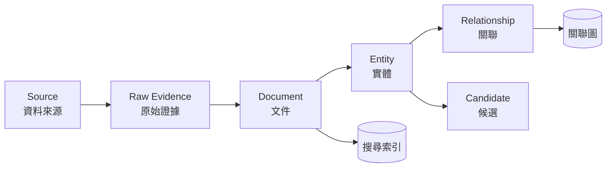

# 核心概念

這一頁解釋文件裡反覆出現的名詞。了解這幾個概念，其餘的功能都很好理解。

## 一張圖看資料怎麼流動

---

## Source（資料來源）

**「資料是從哪裡來的」。** 例如某個資安部落格的 RSS、某個情報廠商的 API、你手動上傳的一批檔案。

每一筆收進來的資料都必須掛在一個 Source 底下。這是為了之後能回答「這個結論的依據是誰說的」。

來源類型：`rss`、`atom`、`static_web`、`rest_api`、`manual_upload`、`json_import`、
`csv_import`、`stix_import`。

## Connector（連接器）

**「怎麼去拿」。** 同一個 Source 可以有抓取設定（多久抓一次、要不要帶認證）。
手動匯入時系統會自動建立一個，不用自己設定。

## Raw Evidence（原始證據）

**收進來的原始內容，一個位元組都不改。** 系統會記錄：

- 內容本身（存在物件儲存裡）
- SHA-256 雜湊值（證明內容沒被動過）
- 從哪個 Source、哪個網址、什麼時間收進來
- 當時的 HTTP 狀態碼與標頭

**原始證據不可修改、不可刪除。** 後面所有的整理、抽取、合併都是在它之上「衍生」的，
原件永遠在。這讓每個結論都能追溯回原始依據。

## Document（文件）

**把原始證據整理成統一格式。** 不管原本是 RSS、HTML、JSON 還是 CSV，整理後都有一樣的欄位：
標題、內文、摘要、作者、發布時間、語言、網址。

一份原始證據可以產生多份文件（例如一個 JSON 檔裡有 10 篇公告，就產生 10 份文件）。

### 去重

同一篇文章被多個網站轉載時，系統會偵測到內容相同或高度相似，把它們歸為一個**重複群組**，
並標出哪一篇是原始版本。**被判定為重複的文件不會被刪除**——仍然查得到，只是預設列表不顯示。

## Entity（實體）

**從文件裡抽出來的「情報指標」或「對象」。**

| 類型 | 例子 | 怎麼取得 |
|---|---|---|
| 漏洞 `vulnerability` | `CVE-2026-31337` | 從文字自動抽取 |
| IP `ip` | `203.0.113.45` | 從文字自動抽取 |
| 網域 `domain` | `c2.malicious-example.net` | 從文字自動抽取 |
| 網址 `url` | `https://example.com/advisory` | 從文字自動抽取 |
| Email `email` | `psirt@example.com` | 從文字自動抽取 |
| 雜湊值 `hash` | MD5／SHA-1／SHA-256 | 從文字自動抽取 |
| 帳號 `account` | GitHub／Twitter／Telegram 帳號 | 從文字裡的網址抽取 |
| 人員 `person` | 文章作者 | 從作者欄位 |
| 組織 `organization` | 某家公司、某個駭客組織 | 從發布單位／feed 標題／網站名稱等結構化欄位；STIX 的 `identity` |

完整清單與規則見 [實體類型](../reference/entity-types.md)。

**同一個實體只會有一筆。** 十篇文章都提到 `CVE-2026-31337`，系統裡只有一個 `CVE-2026-31337`，
但它會記得「我出現在這十篇文章裡」。

### 實體合併

有時兩個實體其實是同一個東西（例如 `Acme Corp` 和 `ACME Corporation`）。系統會找出可能相同的
配對，由人工確認或依信心分數自動合併。合併後原本的兩筆都保留，只是標記「已併入另一筆」，
隨時可以追溯。

## Relationship（關聯）

**兩個東西之間的關係。** 例如：

- 文件 **提到（mentions）** 某個 CVE
- 文件 **作者是（authored_by）** 某個人
- 網址 **屬於（belongs_to）** 某個網域
- Email **關聯到（associated_with）** 某個網域

關聯存在主資料庫裡，**實體和實體之間**的關聯會另外畫到關聯圖（Neo4j）上。

## Collection（調查集合）

**一次調查的範圍。** 例如「Acme Router 攻擊事件調查」。一份來源或連接器可以同時屬於多個
集合；之後收集或匯入的原始證據與文件會繼承當時掛上的集合。Discovery 發現的新目標也會掛在
某個 Collection 底下，並受這個 Collection 的預算限制（每天最多發現幾個、最多往外擴幾層）。

把來源加進集合**不會回填**已經落地的舊資料——只影響之後收進來的。這是刻意的：回填等於改寫
「這筆資料當時屬於哪個調查」。

## Seed 與 Candidate（種子與候選）

**Discovery（發現新關聯）用的兩個概念。**

- **Seed（種子）**：你告訴系統「從這裡開始找」的起點，例如一個組織名稱或一個關鍵字。
- **Candidate（候選）**：系統找到的「可能相關的新目標」。

**系統找到的東西一律先當候選，不會直接當成確定的結論。** 每個候選都附有「為什麼認為它相關」的
證據，由人工決定核准或拒絕。這是為了避免自動化把錯誤的關聯當成事實擴散出去。

詳見 [發現新關聯](../usage/discovery.md)。

## 真實資料在哪裡

這個系統有好幾個資料庫，但**只有一個是真相**：

| 儲存 | 角色 |
|---|---|
| **PostgreSQL** | **唯一的真實資料來源**。所有資料以這裡為準 |
| 物件儲存（SeaweedFS） | 原始證據的內容本身 |
| OpenSearch | 搜尋索引——從 PostgreSQL 產生，**可以整個刪掉重建** |
| Neo4j | 關聯圖——從 PostgreSQL 產生，**可以整個刪掉重建** |

所以如果搜尋結果和實際資料不一致，以 PostgreSQL 為準，重建搜尋索引即可。
